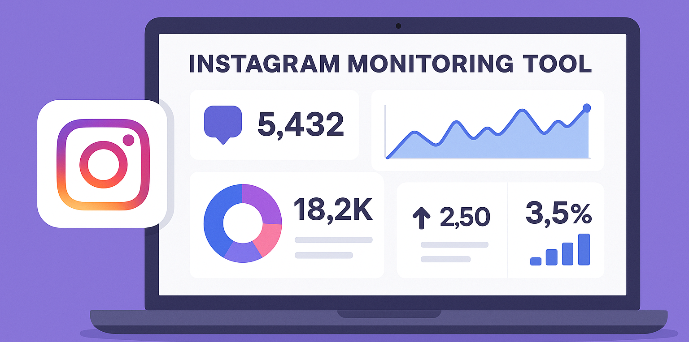

# instagram-monitoring-tool

A complete monitoring solution to track hashtags, mentions, and influencer activities — built for marketers, agencies, and social media teams aiming to grow smarter with data-driven insights.

<p align="center">
  <a href="https://t.me/devpilot1" target="_blank">
    
  </a>
  <a href="https://discord.gg/vBu9huKBvy" target="_blank">
    
  </a>
  <a href="https://wa.me/447723343390?text=Hi%20Zeeshan%2C%20I%27m%20interested%20in%20automation." target="_blank">
    
  </a>
  <a href="mailto:support@appilot.app" target="_blank">
    
  </a>
</p>

<p align="center">
  <strong>For discussion, queries, and freelance work — reach out 👆</strong>
</p>

---

## Introduction
> This project helps brands monitor hashtags, track mentions, analyze competitor growth, and identify key influencers in their niche. Ideal for agencies, creators, and marketing teams aiming to improve Instagram ROI.

<p align="center">
  
</p>

### Key Benefits
1. Real-time monitoring of hashtags, mentions, and competitors.  
2. Identifies influencers and engagement trends.  
3. Boosts brand visibility and audience targeting.  
4. Tracks growth and engagement over time.  
5. Saves time with automated insights and reports.

---

## Features
| Feature | Description |
|----------|-------------|
| Hashtag Tracker | Monitor engagement and reach for chosen hashtags. |
| Influencer Detection | Identify top-performing creators in your niche. |
| Sentiment Analysis | Understand audience emotions toward posts. |
| Competitor Insights | Compare brand performance vs. competitors. |
| Automated Reports | Weekly summaries with actionable insights. |

---

## Use Cases
- Marketing agencies tracking campaign performance.  
- Brands analyzing hashtag engagement.  
- Influencers monitoring competitors.  
- Businesses finding collaboration opportunities.  

---

## FAQs

**Q:** How can monitoring tools improve hashtag strategy?  
**A:** By tracking hashtag performance, engagement, and audience sentiment, monitoring tools help marketers identify high-performing hashtags and discard low-impact ones — optimizing reach and visibility.

**Q:** How do businesses benefit financially from monitoring Instagram?  
**A:** Businesses gain insights on what drives engagement, improving ad targeting, influencer partnerships, and content strategies — leading to better ROI and increased sales.

**Q:** Can monitoring tools identify influencers?  
**A:** Yes, advanced monitoring tools use engagement data, follower growth, and content performance to automatically identify relevant influencers aligned with your brand goals.

---

## Results
----------------------------------- 
> 10x faster trend discovery  
> 50% higher hashtag engagement  
> Improved influencer ROI and brand awareness  

## Performance Metrics
-----------------------------------
Average Benchmarks:  
- **Speed:** Real-time updates  
- **Stability:** 99.4% uptime  
- **Accuracy:** 95% sentiment detection  
- **Throughput:** 10k+ posts analyzed daily  

---

## Do you have a customize project for us?
Contact Us

<div align="center">
  <a href="https://mail.google.com/mail/u/?authuser=ahmadzee26@gmail.com">
    
    <code>support@appilot.app</code>
  </a>
  <span> ┃ </span>
  <a href="https://t.me/devpilot1">
    
    <code>pilot</code>
  </a>
  <span> ┃ </span>
  <a href="https://discord.com">
    
    <code>zee#2655</code>
  </a>
  <span> ┃ </span>
  <a href="https://wa.me/447723343390?text=Hi%20Zeeshan%2C%20I%27m%20interested%20in%20automation." target="_blank">
    
    <code>whatsapp</code>
  </a>
  <br />
</div>

---

## Installation

### Pre-requisites
- Node.js or Python  
- Git  
- Docker (optional)  

### Steps
```bash
# Clone the repo
git clone https://github.com/yourusername/instagram-monitoring-tool.git
cd instagram-monitoring-tool

# Install dependencies
npm install
# or
pip install -r requirements.txt

# Setup environment
cp .env.example .env

# Run
npm start
# or
python main.py
